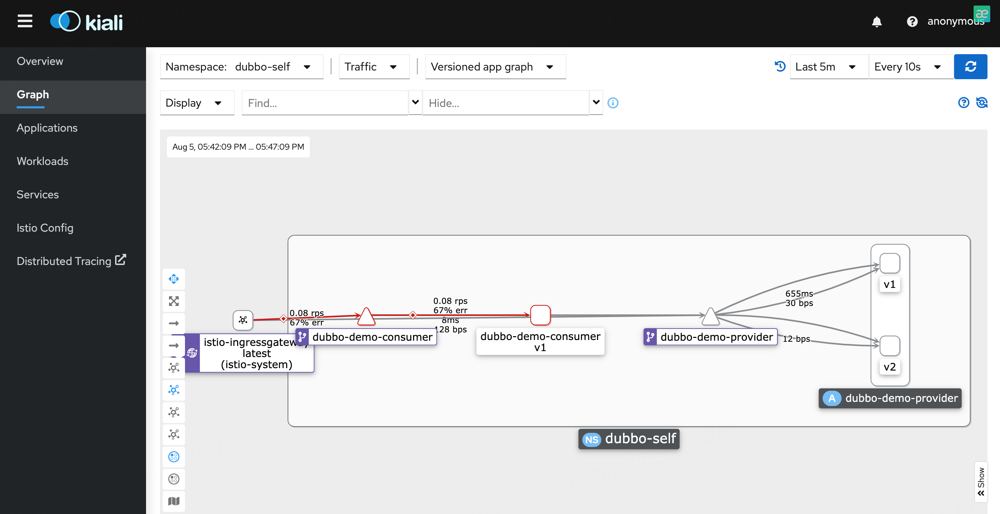
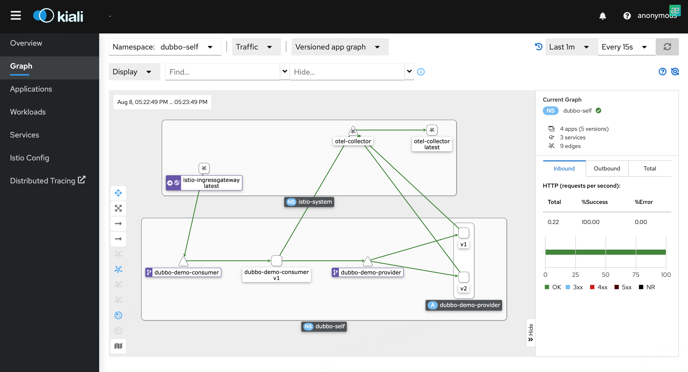
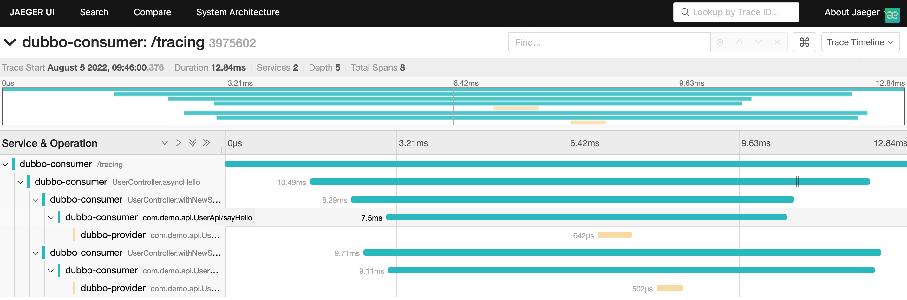
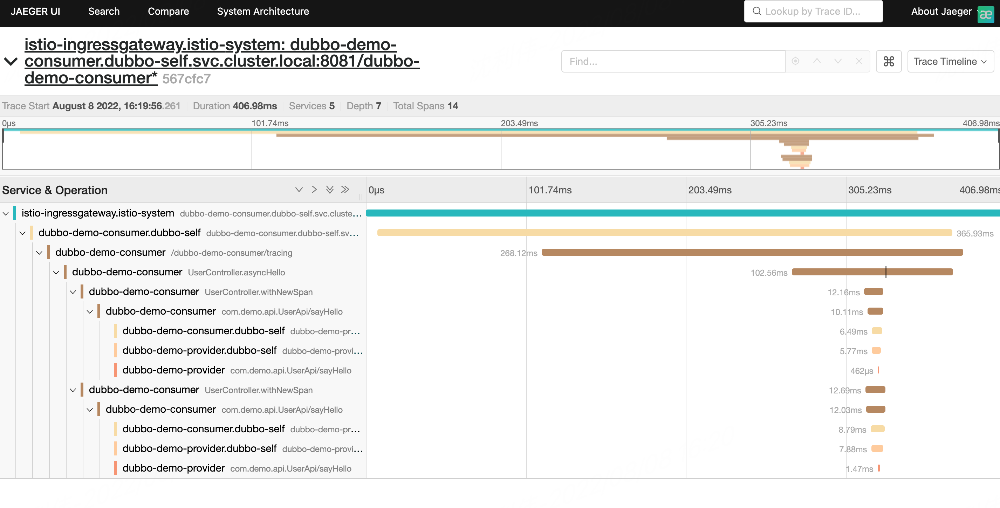
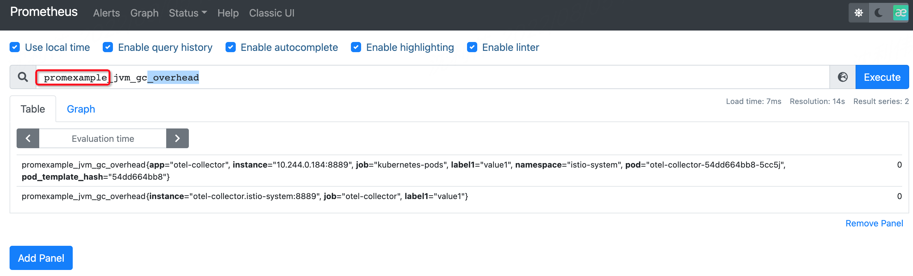
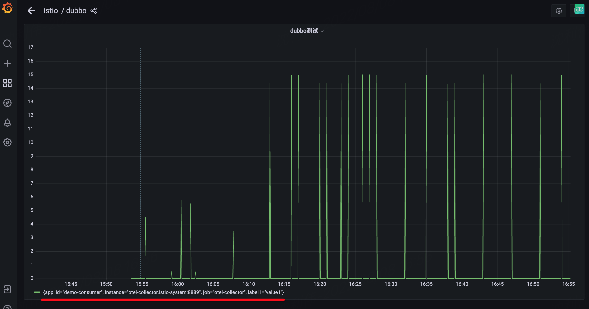

# dubbo3-demo

## 介绍
dubbo3 + triple

## 软件架构


## 使用说明
0. 前提
```
配置环境变量或修改gradle.properties文件，添加私服与阿里云镜像账号密码
export NEXUS_USERNAME=私服用户名
export NEXUS_PASSWORD=私服密码
export JIB_USERNAME=阿里云镜像账号
export JIB_PASSWORD=阿里云镜像密码
```
1. 启动前添加JVM参数
```
--add-opens java.base/sun.net.util=ALL-UNNAMED --add-opens java.base/java.lang=ALL-UNNAMED --add-opens java.base/java.math=ALL-UNNAMED
```
2. 启用opentelemetry添加JVM参数
```
-javaagent:scripts/extra/opentelemetry-javaagent.jar
-Dotel.resource.attributes=service.name=dubbo-demo-consumer或者dubbo-demo-provider

-Dotel.traces.exporter=jaeger
-Dotel.exporter.jaeger.endpoint=http://172.18.30.246:31730
-Dotel.metrics.exporter=none
-Dotel.propagators=b3

-- 或者
-Dotel.traces.exporter=otlp
-Dotel.exporter.otlp.endpoint=http://172.18.30.246:32242
-Dotel.metrics.exporter=none
-Dotel.propagators=b3


-- demo 
-javaagent:scripts/extra/opentelemetry-javaagent.jar
-Dotel.resource.attributes=service.name=dubbo-demo-provider
-Dotel.traces.exporter=otlp
-Dotel.metrics.exporter=otlp
-Dotel.propagators=b3
-Dotel.exporter.otlp.endpoint=http://172.18.30.246:32242

-javaagent:scripts/extra/opentelemetry-javaagent.jar
-Dotel.resource.attributes=service.name=dubbo-demo-consumer
-Dotel.traces.exporter=otlp
-Dotel.metrics.exporter=otlp
-Dotel.propagators=b3
-Dotel.exporter.otlp.endpoint=http://172.18.30.246:32242
```
[参数配置参考](https://github.com/open-telemetry/opentelemetry-java/blob/main/sdk-extensions/autoconfigure/README.md)
[官方文档](https://opentelemetry.io/docs/instrumentation/java/automatic/agent-config/)
[阿里云文档](https://help.aliyun.com/document_detail/413964.html)
[GITHUB](https://github.com/open-telemetry)
[DOCS-CN](https://github.com/open-telemetry/docs-cn)
[JAVA-DOCS](https://github.com/open-telemetry/opentelemetry-java-docs)


```可观测地址
a) grafana http://172.18.30.246:30611/

b) prometheus http://172.18.30.246:30004/

c) kiali http://172.18.30.246:30003/

d) jaeger http://172.18.30.246:30415/jaeger

e) 消费端入口访问地址: http://172.18.30.246/dubbo-demo-consumer/hello | http://172.18.30.246/dubbo-demo-consumer/tracing
```

3. [google jib 镜像打包工具](https://github.com/GoogleContainerTools/jib)
     [如何添加参数到镜像](https://github.com/GoogleContainerTools/jib/blob/master/docs/faq.md#how-do-i-set-parameters-for-my-image-at-runtime)

4. [Kustomize管理yaml清单](https://kubernetes.io/zh-cn/docs/tasks/manage-kubernetes-objects/kustomization/)

```
#使用命令将所有文件串联
kustomize build ../base


# 直接使用kubectl apply -k （集群版本要高于1.14）
kubectl apply -k ../base/
# 还可以通过kustomize命令
kustomize build ../base | kubectl apply -f -


#发布使用dev目录
kustomize build overlays/dev/ | kubectl apply -f -
```


## 待完成
1. 先使用springboot作为存活探针，后期可使用dubbo自定义存活与就绪探针(官方支持扩展)

## 示例图片










